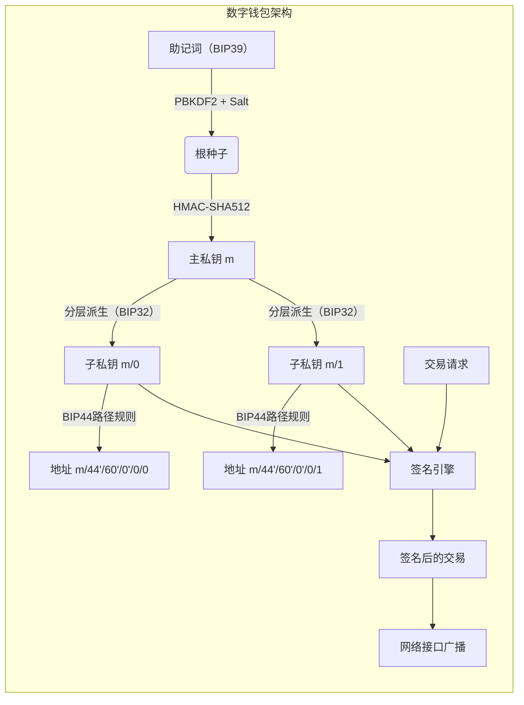
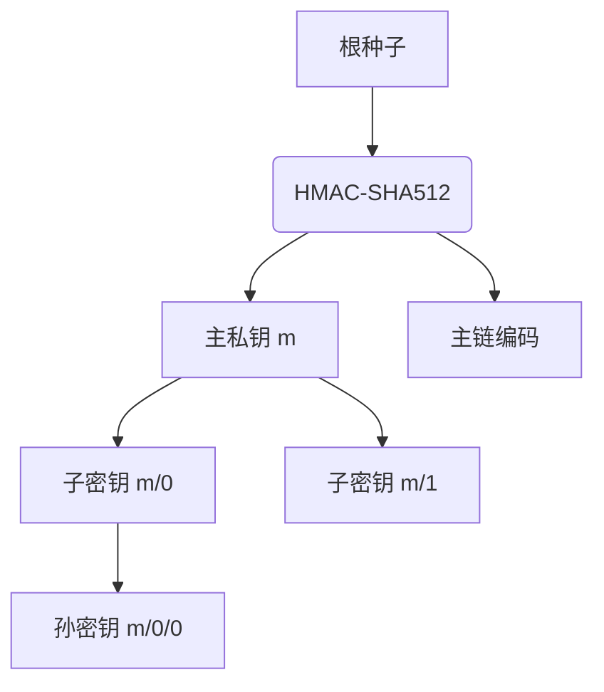

数字钱包是进入加密货币世界的核心工具，本质是一套精密的密钥管理系统，而非简单的"存储容器"。

<!--more-->

## 数字钱包
数字钱包是一种用于管理加密货币的工具，核心功能包括生成密钥对、存储资产、签署交易以及与区块链网络交互。其本质是密钥管理系统：

- ​私钥：控制资产的唯一凭证（所有权证明）。
- ​公钥：生成接收地址，公开可见。
- ​地址：由公钥衍生（如Base58Check编码），用于接收资金。

## BIP32：分层确定性钱包（HD Wallet）

**原理**
BIP32（Bitcoin Improvement Proposal 32）提出了一种分层确定性钱包（HD Wallet）​的结构，允许从单个种子（Seed）生成树状结构的密钥对。其核心思想是通过分层推导实现密钥的无限扩展，同时仅需备份一个主种子即可恢复所有密钥。

**关键流程：**

- ​根种子生成：通过随机熵源生成一个根种子（通常为128-256位）。
- ​主密钥派生：使用HMAC-SHA512算法将根种子拆分为主私钥（m）和主链编码（Chain Code）。
- 子密钥派生：通过父私钥/公钥、链编码和索引号，逐层生成子密钥树。

**特点：**

- ​确定性：相同种子生成的密钥树完全一致。
- 单向性：子密钥无法推导父密钥或兄弟密钥。
- 强化衍生：索引号≥2³¹时使用父私钥推导，增强安全性。

## BIP39：助记词与种子生成

**原理**
BIP39通过助记词将随机熵转化为易备份的单词序列，并通过PBKDF2算法生成种子。

**生成步骤：**

- ​熵生成：生成128/160/192/224/256位的随机熵。
- 校验和：取熵的SHA256哈希前n位（n=熵长度/32）作为校验和。
- 分割单词：将"熵+校验和"按11位分组，映射到2048个[预定义单词](https://github.com/bitcoin/bips/blob/master/bip-0039/bip-0039-wordlists.md)。
- ​种子生成：使用PBKDF2（助记词 + 盐值 "mnemonic"）生成512位种子

## BIP44：多币种钱包路径规范

**原理**

BIP44基于BIP32定义了标准化的分层路径，支持多币种、多账户的钱包管理。

**路径结构：**

`m / purpose' / coin_type' / account' / change / address_index`

- ​purpose'：固定为44（表示BIP44标准）。
- coin_type'：币种标识（如0=比特币，60=以太坊）[完整的币种列表地址](https://github.com/satoshilabs/slips/blob/master/slip-0044.md)。
- account'：账户索引（从0开始）。
- change：0=外部地址（收款），1=内部地址（找零）。
- address_index：地址序号（从0递增）。

**示例路径：**

- 以太坊主账户第一个地址：`m/44'/60'/0'/0/0`
- 比特币测试网第二个地址：`m/44'/1'/0'/0/1`

## 三者协作关系

- ​BIP39生成助记词，转化为种子。
- BIP32用种子生成主密钥和树状子密钥。
- BIP44定义路径规则，实现多币种、多账户管理。

**优势总结：**

- 易备份：仅需保存助记词或种子。
- ​安全性：种子冷存储，子密钥可热生成。
- ​标准化：跨钱包兼容（如MetaMask、Ledger）

## 写到最后

理解完原理，进行实操才是王道。

为此，我开发了一个简单的网页应用，用于生成和展示HD Wallet的密钥。

可以访问[https://cryptohub.lol/tools/hd-wallet](https://cryptohub.lol/tools/hd-wallet)进行体验。

