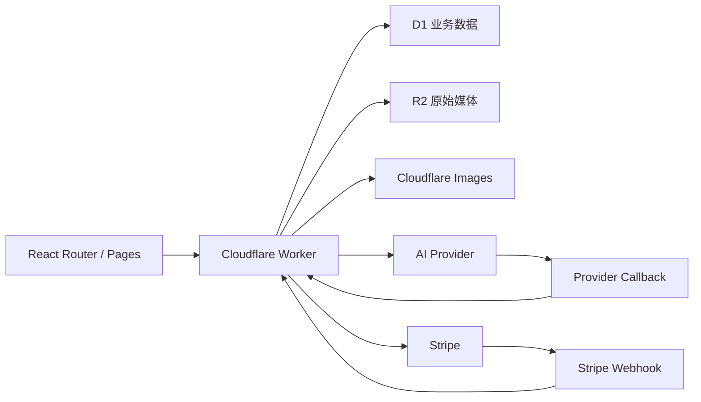

最近半年在开发 Tuziyo 时，我把整个产品的基础设施都放在了 Cloudflare 上。

前端通过 Cloudflare Pages 发布，API 运行在 Cloudflare Workers，业务数据保存在 D1，生成结果进入 R2，再由 Cloudflare Images 按不同页面需要生成缩略图和展示图。

一开始选择这套架构，主要是因为它对独立开发者足够轻：不需要购买服务器，不需要配置 Nginx，也不需要为了一个还在验证阶段的产品提前维护 Kubernetes、数据库主从和复杂的网络环境。

但真正把它用于生产之后，我发现 Serverless 只是省掉了服务器，并没有省掉后端工程。数据一致性、环境隔离、异步任务、数据库迁移、权限校验、幂等和故障恢复，一个都不会自动消失。

这篇文章记录 Tuziyo 使用 Cloudflare Workers + D1 构建生产后端时，最终保留下来的架构和实践。

<!-- truncate -->

## Tuziyo 的后端需要解决什么

Tuziyo 是一个多模型 AI 图片与视频创作工作区。用户可以选择不同模型、上传参考图、发起生成，并在 Session 中持续保留 Prompt、参数、任务状态和多个输出结果。

后端需要同时处理几类完全不同的工作：

- Google 登录、JWT 和用户身份；
- 模型目录、套餐权限和 Credits；
- 同步与异步的图片、视频生成；
- Session、Message、Output 和 Generation Task 的持久化；
- Stripe 订阅与 Webhook；
- R2 文件保存、签名访问和图片变换；
- Provider 回调、失败恢复和定时任务；
- Library 与 Studio 项目数据。

如果只看单个接口，这些逻辑都不复杂。真正的难点是一次生成会跨越多个系统，而且可能在几十秒甚至几分钟后才能完成。



因此，我没有把 Worker 当作几个无状态函数的集合，而是把它作为产品后端的统一入口；D1 则不是简单的配置存储，而是整个业务状态机的落点。

## 用 Hono 组织 Worker，而不是堆条件判断

Cloudflare Worker 最终只有一个 `fetch` 入口。如果所有 API 都写在同一个函数里，很快就会变成大量 pathname 判断和交叉依赖。

Tuziyo 使用 Hono 组织路由，并把接口分成公开路由和登录后路由。

公开路由主要包括：

- Google OAuth Callback；
- 模型列表和公开 Showcase；
- Stripe Webhook；
- AI Provider Callback；
- 带签名的媒体访问接口。

其他业务路由统一挂在认证中间件之后：

```ts
const protectedRoutes = new Hono<{
  Bindings: Env
  Variables: AppVariables
}>()

protectedRoutes.use("*", authMiddleware)

protectedRoutes.post("/api/generate", handleGenerate)
protectedRoutes.get("/api/sessions", handleGetSessions)
protectedRoutes.get("/api/credits", handleGetCredits)
protectedRoutes.post("/api/stripe/checkout", handleCreateCheckoutSession)

app.route("/", protectedRoutes)
```

这个划分带来的价值不只是代码更整洁。它让每个接口的信任边界非常清楚：浏览器带 JWT 的请求走认证路由，Stripe 和生成服务的回调则使用各自的签名、密钥或任务 ID 建立信任。

## JWT 通过后，还要回到 D1 查询用户

JWT 能证明 Token 是系统签发的，但 Token 里的信息可能已经过期。

例如用户订阅发生变化，`user_type` 和 Credits 已经更新，而浏览器仍持有之前签发的 JWT。如果完全相信 Payload，用户就会一直使用旧权限，直到 Token 过期。

Tuziyo 的认证中间件会先验证 JWT，再回到 D1 查询用户和余额：

```ts
const payload = await verify(token, c.env.JWT_SECRET, "HS256")

const dbUser = await c.env.DB
  .prepare("SELECT id, user_type FROM users WHERE id = ?")
  .bind(payload.userId)
  .first()

const credits = await c.env.DB
  .prepare("SELECT balance FROM user_credits WHERE user_id = ?")
  .bind(payload.userId)
  .first()
```

JWT 只负责确认“你是谁”，D1 中的实时数据决定“你现在能做什么”。

这种方式每次请求会多几次数据库读取，但换来了权限和余额的及时同步。对 Tuziyo 这种请求频率有限、但每次生成都有真实成本的产品来说，这个取舍是值得的。

## D1 保存关系，R2 保存对象

生成式产品很容易把所有东西都塞进一张表：Prompt、状态、图片 URL、Provider 返回值和错误信息混在一起。第一次生成能跑通，但一旦支持多图输出、视频和素材库，数据模型会迅速失控。

Tuziyo 现在把不同职责拆开：

- `sessions`：一次持续创作会话；
- `messages`：用户输入和模型请求参数；
- `message_outputs`：一次 Message 对应的多个图片、视频或音频输出；
- `generation_tasks`：异步任务、Provider Task ID、进度和错误；
- `assets`：可以在 Library 和 Studio 中继续复用的稳定素材；
- `subscriptions`、`user_credits`、`credit_transactions`：订阅和 Credits 状态；
- Studio 相关表：项目、角色或场景、Frame、Shot、Version 和 Sequence。

D1 保存关系、状态和检索字段，R2 保存真正的二进制文件。数据库里只保存稳定的 Object Key、媒体类型、尺寸和业务关联。

这是一个很重要的边界：**外部 Provider 返回的临时 URL 不是产品资产。**

Provider URL 可能过期，也可能有访问限制。异步任务完成后，Worker 会尽快把结果下载到 R2，再把稳定的 Storage Key 写入 D1。前端不直接接触 R2 凭证，而是获取短期签名 URL 或经过签名的图片变换地址。

## 所有查询都必须带上所有权条件

API 通过认证，并不代表用户可以读取任意 ID 对应的数据。

下面这种查询是不够的：

```sql
SELECT * FROM sessions WHERE id = ?;
```

它只能证明 Session 存在，不能证明它属于当前用户。Tuziyo 的业务查询会把用户所有权直接放进 SQL：

```sql
SELECT *
FROM sessions
WHERE id = ?
  AND user_id = ?
  AND status = 1;
```

更新和删除同样如此：

```sql
UPDATE sessions
SET status = 2, deleted_at = ?
WHERE id = ? AND user_id = ?;
```

把权限约束放进查询本身，比先查记录、再在 JavaScript 中判断 `user_id` 更不容易遗漏，也减少了检查和修改之间的竞态窗口。

Studio 和 Library 中更深层的数据也会通过 Join 回到所属项目或用户。例如更新一个 Shot Version 时，不只检查 Shot ID，还会关联 `studio_projects.user_id`。

## Prepared Statement 是默认选项

Tuziyo 的 D1 查询统一使用：

```ts
c.env.DB
  .prepare("SELECT ... WHERE user_id = ?")
  .bind(user.userId)
```

除了防止 SQL 注入，这种写法还有一个实际好处：SQL 结构和动态值是分离的，代码审查时可以很快看出查询是否包含 `user_id`、状态条件和正确索引字段。

只有动态更新列等少数场景会拼接 SQL，而且被拼接的列名来自代码内部白名单，用户输入仍然通过 `.bind()` 传入。

## 一次生成必须先原子落库

生成任务开始时，需要同时创建或更新多条数据：

- 新 Session，或者确认传入 Session 属于当前用户；
- 用户 Message；
- Generation Task；
- 一个或多个 Pending Output；
- Session 的更新时间。

如果这些写入逐条执行，第三条失败时，数据库里可能已经出现一个没有 Task 的 Message，前端则会永远等待不存在的结果。

Tuziyo 使用 `D1Database.batch()` 把相关 Statement 一起提交：

```ts
await c.env.DB.batch([
  insertSession,
  insertMessage,
  insertTask,
  ...insertPendingOutputs,
  updateSession,
])
```

这里的重点不是减少网络请求，而是保证业务不变量：只要前端看到了 Pending Message，就一定能找到对应 Task 和 Output。

Credits 也使用相同方式。额度扣减和 `credit_transactions` 流水必须一起成功；订阅额度发放同样不能出现“余额增加了但没有流水”或“有流水但余额没变化”。

## 异步任务先保存状态，再调用 Provider

AI 生成接口与普通 CRUD 最大的区别，是外部调用可能很慢、可能超时，也可能只返回一个 Task ID。

Tuziyo 的处理顺序是：

1. 校验模型、参数、用户权限和 Credits；
2. 在 D1 中创建 Session、Message、Task 和 Pending Output；
3. 调用模型 Provider；
4. 同步结果直接完成 Task；
5. 异步结果保存 `provider_task_id`，等待回调或轮询；
6. 完成后把媒体保存到 R2，并更新 Task、Output 和 Asset；
7. 失败则持久化错误状态，让前端可以停止等待。

也就是说，在可能失败的外部请求开始前，本地已经有一条可以追踪的任务。

Provider Callback 到达后，会先通过 `provider_task_id` 查询任务。如果任务已经是 `completed` 或 `failed`，直接返回成功：

```ts
if (dbStatus === "completed" || dbStatus === "failed") {
  return c.json({ success: true, message: "Task already processed" })
}
```

这让回调具备基本幂等能力。即使 Provider 重复推送相同结果，也不会重复保存资源和更新业务数据。

## 回调之外还需要恢复任务

生产环境不能假设第三方回调永远可靠。

Provider 可能已经完成生成，但回调因为网络问题没有到达；Worker 也可能在处理过程中遇到临时错误。只依赖 Callback，会让任务永久停留在 `pending` 或 `processing`。

因此 Tuziyo 还保留了每分钟运行的恢复任务：

```toml
[env.prod.triggers]
crons = ["0 0 * * *", "10 0 * * *", "* * * * *"]
```

其中 `* * * * *` 会检查未结束的 Provider Task，补偿漏掉的回调。

这不是用 Cron 代替 Webhook，而是把两者组合起来：

- Webhook 提供低延迟；
- Scheduled Worker 提供最终恢复能力；
- D1 中的 Task 状态保证两条路径可以安全汇合。

## 不要把所有 Cron 塞进一个处理器

Tuziyo 目前有三类定时任务：

- UTC 00:00：为年付订阅发放到期的月度 Credits；
- UTC 00:10：处理支付宽限期和过期订阅额度；
- 每分钟：检查可能遗漏回调的生成任务。

Worker 的 `scheduled` 入口会根据 `controller.cron` 精确分发：

```ts
if (controller.cron === ANNUAL_SUBSCRIPTION_GRANT_CRON) {
  ctx.waitUntil(handleAnnualSubscriptionCreditGrants(env.DB))
  return
}

if (controller.cron === CREDIT_MAINTENANCE_CRON) {
  ctx.waitUntil(handleCreditMaintenance(env.DB))
  return
}
```

以前把不同维护逻辑混在一起时，很难从日志判断哪一步失败，也很难单独测试和重跑。拆开后，每个 Cron 都有明确输入、输出和业务语义。

`ctx.waitUntil()` 也很重要。Scheduled Handler 不需要阻塞等待任务完成，但必须把 Promise 交给 Worker Runtime，避免入口函数返回后后台工作被提前终止。

## Preview 和 Production 必须是两套真实环境

本地开发能验证代码逻辑，却验证不了所有 Cloudflare Binding、远程 D1、R2 和第三方回调配置。

Tuziyo 在 `wrangler.toml` 中明确维护 Preview 和 Production：

```toml
[env.preview]
name = "tuziyo-worker-preview"
routes = [{ pattern = "api-preview.tuziyo.com", custom_domain = true }]

[[env.preview.d1_databases]]
binding = "DB"
database_name = "tuziyo-preview"

[env.prod]
name = "tuziyo-worker"
routes = [{ pattern = "api.tuziyo.com", custom_domain = true }]

[[env.prod.d1_databases]]
binding = "DB"
database_name = "tuziyo-db"
```

两套环境不仅域名不同，D1、R2、前端地址、媒体地址和 Provider Callback 都是独立的。

Preview 不是把生产数据库复制一份到本地，而是一套可以真正接收远程回调、验证 CORS、OAuth、签名 URL 和 Binding 的线上环境。

支付相关 Cron 只配置在 Production。Preview 只保留生成任务恢复 Job，避免测试数据意外触发真实的订阅维护语义。

## 普通变量写配置，密钥交给 Secret

Worker 的 Binding 类型很多，部署时很容易出现“本地文件有配置，但远端版本没有”的漂移。

Tuziyo 把非敏感并且需要随代码部署的配置写在 `wrangler.toml`，例如：

- `FRONTEND_URL`
- `MEDIA_BASE_URL`
- `R2_BUCKET_NAME`
- OAuth Client ID
- Provider Callback URL

真正的凭证则保存在 Cloudflare Secrets：

- JWT Secret；
- Google Client Secret；
- Stripe Secret Key 和 Webhook Secret；
- R2 访问密钥；
- AI Provider API Key；
- 媒体 URL 签名密钥。

只执行 `wrangler secret list` 并不能完成环境审计，因为它看不到普通变量、D1、R2、Images、AI 等 Binding，也无法解释同名值到底是 `secret_text` 还是 `plain_text`。

生产检查时，我会同时核对：

```bash
npx wrangler versions view <version-id> --env prod --json
npx wrangler secret list --env prod
npx wrangler deploy --env prod --dry-run
```

远端已部署版本的 Binding 才是运行时事实；`wrangler.toml` 是下一次部署想要得到的状态。两者都要看。

## D1 约束不是文档，而是最后一道业务防线

在应用层做校验是必要的，但并发和重试最终仍需要数据库约束兜底。

Tuziyo 在 D1 Schema 中大量使用：

- `FOREIGN KEY ... ON DELETE CASCADE` 保持关联数据完整；
- `CHECK` 限定状态、媒体类型和余额变化；
- `UNIQUE(message_id, output_index)` 防止输出序号重复；
- `UNIQUE(provider, provider_account_id)` 防止同一外部账号重复绑定；
- Stripe Invoice 与订阅 Credits 周期唯一索引防止重复发放；
- Library 的 `source_output_id` 唯一，避免同一生成结果重复入库；
- Studio 的 Shot Version、Sequence Position 使用唯一约束维护顺序。

例如 Stripe Webhook 会先检查 Invoice 是否处理过，但两个并发请求可能同时得到“没有”。真正防止重复 Credits 的，是 D1 中的唯一索引，而不是那次 `SELECT`。

应用层检查负责给出友好的行为，数据库约束负责保证不变量永远成立。

## `schema.sql` 和 Migration 承担不同职责

Tuziyo 同时维护两类 SQL：

- `db/schema.sql`：新建数据库时应该得到的完整最新结构；
- `db/migrations/*.sql`：已经存在数据时，从旧版本演进到新版本的增量步骤。

只维护 Migration，会导致新环境初始化必须从第一条历史 SQL 开始执行；只维护最终 Schema，又无法安全升级已有生产数据。

每次涉及字段或数据语义变化时，需要同时回答两个问题：

1. 一个全新的 D1 能否直接通过 `schema.sql` 得到正确结构？
2. 已经运行中的 D1 能否通过 Migration 保留数据并升级？

像 `messages.image_url` 迁移到多输出表时，不能只删除旧字段。迁移需要先把历史图片回填到 `message_outputs`，再调整收藏关系和任务引用，最后才能移除重复的数据源。

Schema 变更不仅是 DDL，也是数据迁移和 API Contract 迁移。

## 远程 D1 操作必须先验证目标

D1 最危险的操作通常不是复杂 SQL，而是在正确命令中选错环境。

执行导入、查询或重置前，我会先确认：

- 当前 Shell 位于仓库根目录还是 `worker/`；
- 使用的是 Preview 还是 Production；
- D1 Binding 和 Database Name 是否匹配；
- `schema.sql` 是否已通过本地 SQLite 验证；
- 远程 `sqlite_master` 中当前有哪些表和索引；
- 生产操作是否已经导出备份。

在仓库根目录执行时，命令形状是：

```bash
npx wrangler d1 execute tuziyo-preview \
  -c worker/wrangler.toml \
  --env preview \
  --remote \
  --command "SELECT name FROM sqlite_master WHERE type = 'table';"
```

如果已经进入 `worker/`，配置路径必须跟着改变：

```bash
bunx wrangler d1 execute tuziyo-preview \
  --config wrangler.toml \
  --env preview \
  --remote \
  --command "SELECT * FROM messages LIMIT 10;"
```

`cwd` 不是命令之外的上下文，而是 Wrangler 命令契约的一部分。这个细节看起来很小，却是远程数据库操作中非常常见的错误来源。

## 初始化或重置前，先证明 Schema 可用

我现在使用的验证顺序是：

1. 在内存 SQLite 中加载 `db/schema.sql`；
2. 执行 `PRAGMA foreign_key_check`；
3. 搜索 Worker 中真实使用的表名和字段；
4. 对比 Migration 和最终 Schema；
5. 查询远程 `sqlite_master`；
6. 确认各业务表行数和目标环境；
7. 再执行远程导入或迁移；
8. 导入后重复结构、外键和行数验证；
9. 最后运行 Worker TypeScript 检查。

一次命令成功只代表 SQL 被接受，不代表结构与当前代码一致。真正的验证必须同时覆盖 Schema、代码调用点和远程数据库。

## 可观测性要能回答“哪一个状态没推进”

Tuziyo 在 Preview 和 Production 都开启了 Worker Invocation Logs。

对于异步产品，只记录“接口报错”是不够的。日志至少需要带上能够串起请求链路的信息：

- 本地 Task ID；
- Provider Task ID；
- Session 和 Message ID；
- Provider 和模型；
- 当前状态；
- Callback 类型；
- Stripe Event、Invoice 或 Subscription ID；
- Cron 名称和处理结果。

这样排查问题时，才能回答：

- 任务有没有成功写入 D1？
- Provider 有没有返回 Task ID？
- Callback 有没有到达？
- 输出有没有保存到 R2？
- D1 Task 为什么没有从 Processing 变成 Completed？
- Credits 是没有发放，还是已经被幂等规则跳过？

对 Serverless 来说，看不到一台持续运行的服务器，结构化状态和可检索日志反而更加重要。

## Workers + D1 带来的真实收益

使用这套架构后，我不需要维护服务器、证书、负载均衡和数据库进程。Preview 和 Production 可以使用相同代码、不同 Binding 部署，Worker 能直接访问 D1、R2、Images 和 AI 服务。

对独立开发者来说，这带来的最大价值并不是某个接口快了几毫秒，而是减少了大量与产品核心无关的运维切换。

但它也要求开发方式发生变化：

- 不依赖单个 Worker 实例的内存状态；
- 长任务拆成持久化状态和异步回调；
- 重要写入使用 Batch 和数据库约束；
- 外部事件按“至少一次”投递设计；
- Preview 使用真实 Cloudflare 资源验证；
- 每次远程数据库操作明确环境和工作目录；
- 通过 Cron 补偿漏掉的异步事件；
- 把 R2 Object Key 而不是临时 URL 当作资产引用。

## 写在最后

Cloudflare Workers + D1 很适合 Tuziyo 这样的 Side Project：上线成本低，产品接入顺滑，也能随着业务逐步增加 R2、Images、Cron 和其他平台能力。

不过，平台把服务器藏起来之后，工程问题并不会消失。生产级代码的标准仍然是：状态可以追踪，写入具备原子性，事件可以重复执行，环境不会互相污染，数据库可以安全演进，失败之后系统能够恢复。

这也是我做 Tuziyo 最大的收获之一。

以前我会把“部署成功”当作后端完成的标志；现在更在意的是，当某个 Provider 延迟、Webhook 重试、Cron 重复、Schema 漂移或者远程 Binding 配错时，系统是否仍然能够给出一个确定、可修复的结果。

Workers 和 D1 让独立开发者可以用很低的成本拥有一套完整基础设施，而真正决定它能不能进入生产的，仍然是这些藏在正常流程背后的边界设计。
