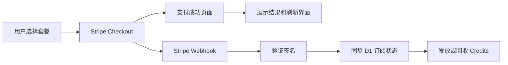

最近在给 Tuziyo 接入 Stripe 订阅支付。

最开始的目标看起来很简单：用户选择套餐，跳转到 Stripe Checkout，支付成功后升级会员并发放 Credits。但真正开始处理续费、支付失败、取消订阅和年度套餐后，我发现支付成功页面只是整个流程中最轻的一部分。

真正决定这套系统能不能稳定运行的，是 Webhook。

Stripe 的事件可能延迟、乱序，也可能因为超时被重复投递。如果把每一次 Webhook 都当成只会执行一次的普通回调，最直接的后果就是重复发放 Credits，或者 Stripe 和本地数据库中的订阅状态不一致。

这篇文章记录 Tuziyo 当前订阅了哪些 Stripe 事件、每个事件做了什么，以及我如何用 Cloudflare Workers 和 D1 处理 Webhook 幂等与订阅状态同步。

<!-- truncate -->

## 为什么不能相信支付成功页面

Tuziyo 使用 Stripe Checkout 创建订阅。支付完成后，Stripe 会把用户重定向到：

```text
/pricing?success=true&session_id={CHECKOUT_SESSION_ID}
```

前端可以根据 `session_id` 查询 Checkout Session，用来展示支付结果、刷新用户状态和记录转化。但这个跳转不能作为发放权益的依据。

原因很简单：

- 用户支付后可能直接关闭页面；
- 浏览器跳转可能因为网络问题失败；
- 成功页面可以被重复打开；
- 前端传入的状态不能代替 Stripe 服务端的支付结果；
- 续费发生时，用户根本不会再次经过 Checkout 成功页。

因此，Tuziyo 把前端查询当作用户体验的一部分，把 Webhook 当作订阅状态变化的服务端入口。



## Webhook 入口先做签名验证

Webhook 路由是公开接口，因为请求来自 Stripe，而不是已经登录的用户。公开不代表可以相信请求内容。

Cloudflare Worker 会读取原始请求体和 `stripe-signature`，再使用 `STRIPE_WEBHOOK_SECRET` 调用 Stripe SDK 完成签名验证：

```ts
const signature = c.req.header("stripe-signature")
const body = await c.req.text()

const event = await stripe.webhooks.constructEventAsync(
  body,
  signature,
  c.env.STRIPE_WEBHOOK_SECRET
)
```

这里必须使用原始请求体。如果先把请求解析成 JSON 再重新序列化，内容中的细微变化就可能导致签名验证失败。

只有验证通过的事件才会进入后续业务逻辑。验证失败直接返回 `400`，处理完成则返回：

```json
{ "received": true }
```

## Tuziyo 当前处理的 6 类事件

目前 Webhook 处理器关注下面 6 类 Stripe 事件：

| 事件 | 在 Tuziyo 中承担的职责 |
| --- | --- |
| `checkout.session.completed` | 首次订阅落库、读取套餐配置、发放首期 Credits、升级用户类型 |
| `customer.subscription.created` | 当前只记录事件，不在这里发放权益 |
| `customer.subscription.updated` | 同步套餐、状态、账期、额度配置和用户类型 |
| `customer.subscription.deleted` | 标记订阅取消、清空订阅 Credits、将用户降级为 Free |
| `invoice.paid` | 只处理真实续费账单，更新账期并发放续费 Credits |
| `invoice.payment_failed` | 标记 `past_due`，记录失败时间并启动 7 天宽限期 |

事件虽然都与订阅有关，但它们的职责并不相同。最重要的一条规则是：**状态同步和 Credits 发放必须分开考虑。**

`customer.subscription.updated` 适合告诉本地“订阅现在是什么状态”，却不能直接证明这一期已经成功收款；`invoice.paid` 能证明账单支付成功，但首次订阅又会同时产生 Checkout 和 Invoice 相关事件。

如果没有明确边界，同一笔付款很容易从多个事件重复发放权益。

## 首次订阅：`checkout.session.completed`

首次开通以 `checkout.session.completed` 为入口。

创建 Checkout Session 时，Tuziyo 会把内部用户 ID、Price ID 和套餐名称写入 metadata：

```ts
metadata: {
  userId: user.userId,
  priceId,
  plan: planName,
}
```

Webhook 收到事件后，使用这些字段关联本地用户，再从 Stripe 获取完整 Subscription、Price 和 Product 信息。套餐能发放多少 Credits、对应哪一种用户类型，不写死在 Webhook 中，而是优先读取 Stripe Product metadata：

```text
credits=500
user_type=professional
```

随后完成三件事：

1. 将 Stripe Subscription、Customer、Price、套餐、状态和账期写入 `subscriptions`；
2. 根据月付或年付生成首个 Credits 周期；
3. 发放首期订阅 Credits，并更新 `users.user_type`。

订阅记录使用 `ON CONFLICT(user_id) DO UPDATE`。同一用户重新订阅或收到重复状态时，本地保存的是最新 Stripe 状态，而不是不断插入新的订阅记录。

### 为什么 `customer.subscription.created` 不发放 Credits

创建订阅时，Stripe 也会产生 `customer.subscription.created`。Tuziyo 当前会接收并记录它，但不在这里做权益发放。

这是刻意保留的边界。Subscription 被创建时可能仍处于 `incomplete`，并不等于用户已经完成付款。如果 `subscription.created` 和 `checkout.session.completed` 都发放 Credits，同一笔首次订阅就需要处理两条发放路径，幂等复杂度会明显增加。

所以当前策略是：

- `customer.subscription.created` 只作为生命周期信息；
- `checkout.session.completed` 负责首次订阅初始化；
- `invoice.paid` 负责后续续费。

## 续费：只处理 `invoice.paid` 的订阅周期账单

`invoice.paid` 不一定代表续费。首次创建订阅、手动调整账单或者其他账单行为，也可能产生这个事件。

Tuziyo 只处理下面这种情况：

```ts
invoice.billing_reason === "subscription_cycle"
```

也就是说，只有 Stripe 明确标记为正常订阅周期的账单，才进入续费逻辑。首次订阅对应的 `subscription_create` 不会再次发放 Credits。

续费事件到达后，Worker 会：

1. 从 Invoice 中解析 Subscription ID；
2. 向 Stripe 查询最新订阅和账期；
3. 从当前 Price 对应的 Product metadata 重新读取额度；
4. 更新本地订阅状态和 `current_period_start/end`；
5. 清除之前的支付失败和宽限期字段；
6. 确认 Invoice 尚未发放过 Credits；
7. 写入新的订阅额度和交易流水。

这里没有直接沿用本地历史额度，而是重新读取 Stripe Product metadata。这样在 Stripe 后台调整套餐额度后，新账期可以自然使用新的配置。

## 幂等不是一次 `SELECT`，而是多层防线

Stripe 会在 Webhook 请求超时、返回错误或者网络不稳定时重试。同一事件执行两次不是异常情况，而是必须提前设计的正常情况。

Tuziyo 的幂等处理分为几层。

### 第一层：订阅记录唯一

`subscriptions` 对下面三个字段建立了唯一约束：

- `user_id`
- `stripe_subscription_id`
- `stripe_customer_id`

首次订阅前还会按 `stripe_subscription_id` 检查记录是否已经存在。重复的 `checkout.session.completed` 仍可以更新订阅状态，但不会再次走初始额度发放。

### 第二层：Invoice ID 唯一

每一次真实收款对应一个 Stripe Invoice。`credit_transactions` 单独保存 `invoice_id`，并建立条件唯一索引：

```sql
CREATE UNIQUE INDEX idx_credit_transactions_invoice_id
ON credit_transactions(invoice_id)
WHERE invoice_id IS NOT NULL;
```

续费发放前会先查询 Invoice 是否已经处理。即使两个相同事件并发通过了这次查询，最终插入时仍会被数据库唯一约束挡住。

这比把 Invoice ID 拼进 `description`，再使用 `LIKE` 查询可靠得多。描述字段是给人看的，幂等标识应该使用结构化字段。

### 第三层：Credits 周期唯一

年付套餐只产生一次年度账单，但 Tuziyo 按月发放订阅 Credits。后续月份没有新的 Invoice ID，因此只依赖 Invoice 无法防止重复发放。

为此，交易表还为“用户 + Credits 周期”建立了唯一约束：

```sql
CREATE UNIQUE INDEX idx_credit_transactions_subscription_period
ON credit_transactions(user_id, credit_period_start, credit_period_end)
WHERE type = 'subscription'
  AND credit_period_start IS NOT NULL
  AND credit_period_end IS NOT NULL;
```

这样，无论额度来自首次订阅、正常续费还是年付套餐的月度 Cron，同一个用户的同一周期都只能成功写入一次。

### 第四层：流水和余额一起提交

发放订阅 Credits 时，系统需要同时修改两类数据：

- 在 `credit_transactions` 中记录真实额度变动；
- 在 `user_credits` 中更新当前余额和订阅额度周期。

这两个 D1 Statement 通过 `db.batch()` 一起执行。不能出现流水已经写入但余额没有增加，或者余额增加却没有可追踪流水的中间状态。

另外，`credit_transactions.amount` 有 `CHECK(amount != 0)` 约束；没有真实额度变化的维护操作不会写入流水表。交易流水只表达真实的发放、购买和消耗，不承担状态维护日志的职责。

## 月付和年付为什么要分开

月付订阅每个月都会产生新的 Invoice，因此 `invoice.paid` 可以同时完成续费确认和本月 Credits 发放。

年付订阅不同：Stripe 一次收取一整年的费用，但产品希望每个月发放固定 Credits，而不是第一天把全年额度全部给出。

Tuziyo 的处理方式是：

- 首次年付成功，只发放第一个月的 Credits；
- 在订阅记录中保存 `last_credit_grant_at` 和 `next_credit_grant_at`；
- 每天 UTC 00:00 执行年付订阅月度发放任务；
- 每次只发放当前到期周期，并把 `next_credit_grant_at` 推进一个月；
- 使用 Credits 周期唯一索引避免 Cron 重试或重复运行导致多发。

计算“下一个月”时也不能简单地增加 30 天。代码使用 UTC 日历月份，并处理 29、30、31 日跨月的问题，确保 1 月 31 日之后不会因为日期溢出产生错误账期。

## 订阅状态如何保持同步

支付系统并不是只有“已付款”和“未付款”两个状态。用户可能升级套餐、降级套餐、取消续订、支付失败，或者在一段时间后彻底结束订阅。

### `customer.subscription.updated`

该事件负责同步：

- Stripe Subscription 状态；
- 当前 Price 和套餐名称；
- 当前账期开始、结束时间；
- 月付或年付类型；
- 每月应该发放的 Credits；
- 用户对应的会员类型。

当状态为 `active` 或 `trialing` 时，用户类型按 Stripe Product metadata 更新；非活跃状态则会同步为 Free，并记录支付失败时间和宽限期字段。

这里主要做状态投影，不做续费额度发放。是否真的完成新周期付款，仍由 `invoice.paid` 判断。

### `invoice.payment_failed`

支付失败后，订阅被标记为 `past_due`，同时记录：

```text
payment_failed_at
grace_period_ends_at = now + 7 days
```

这里使用 `COALESCE` 保留第一次失败时间。Stripe 可能多次重试扣款，后续失败事件不会不断把宽限期向后延长。

支付失败不会立刻删除用户已经购买的 Credits，也不会直接清空订阅 Credits。每天 UTC 00:10 的维护任务会检查宽限期；超过 7 天仍未恢复的订阅会被标记为取消，订阅 Credits 被清空，用户降级为 Free。

### `customer.subscription.deleted`

当 Stripe 确认订阅已经结束时，系统会立即：

1. 将本地订阅状态更新为 `canceled`；
2. 清空 `subscription_balance` 和订阅 Credits 周期；
3. 保留用户单独购买的 `purchased_balance`；
4. 将总余额重新计算为购买余额；
5. 将用户类型降级为 Free。

“取消订阅 Credits”和“清空所有 Credits”不是一回事。用户额外购买的额度不应该因为订阅结束而消失，所以余额模型从一开始就把订阅额度和购买额度分开保存。

## 如何面对事件乱序

除了重复投递，Webhook 还可能乱序。

例如 `customer.subscription.updated` 可能先于 `checkout.session.completed` 到达。如果本地还没有对应订阅，更新事件找不到记录就不会创建一条信息不完整的数据；之后 `checkout.session.completed` 会主动从 Stripe 查询最新 Subscription，再完成本地初始化。

这也是为什么 Webhook 不应该完全相信事件中有限的展开字段。需要做关键决策时，Tuziyo 会通过 Subscription ID 或 Price ID 再向 Stripe 查询一次当前对象。

本地 D1 保存的是 Stripe 状态在产品侧的投影。Stripe 是支付事实来源，D1 则负责把它转换成产品能够直接使用的会员类型、有效期、余额和流水。

## 测试不只验证“接口返回 200”

支付逻辑最危险的错误通常不会让接口报错，而是悄悄改变用户余额。

目前围绕 Credits 和订阅周期覆盖了这些情况：

- 月付续费为当前完整账期发放额度；
- 年付首次只发放第一个月额度；
- 年付 Cron 到期后发放并推进下一周期；
- 未到期的年付订阅不会提前发放；
- 重复周期不会新增交易记录；
- 月付订阅不会被年付 Cron 处理；
- 消耗时优先使用订阅 Credits，再使用购买 Credits；
- 0 Credits 不会产生余额或流水；
- `past_due` 超过宽限期后，只清理订阅额度并保留购买额度；
- 已结束的订阅不会误删用户购买的 Credits。

另外，续费测试不能只依赖 `stripe trigger invoice.paid`。这个命令生成的是方便调试的模拟事件，不一定具备真实订阅周期的完整上下文。验证生产续费行为时，还需要使用 Stripe Test Clock 或真实测试订阅推进账期。

## 最后的体会

接入 Stripe Checkout 很快，做好订阅系统却需要同时理解事件语义、状态机、账期、数据库约束和失败恢复。

这次在 Tuziyo 中，我最终把几个关键职责分开了：

- Checkout 完成负责首次开通；
- Subscription 事件负责状态同步；
- Invoice 成功负责确认续费；
- Invoice 失败负责进入宽限期；
- 数据库唯一约束负责兜住并发和重试；
- Cron 负责年付月发和过期清理；
- Credits 流水只记录真实余额变化。

Webhook 幂等的重点，不是“尽量不要执行两次”，而是即使同一个事件执行两次、并发执行，甚至以不同顺序到达，最终业务结果仍然只能发生一次。

当支付、订阅、会员身份和 Credits 之间的边界真正清楚之后，这套代码才从一个能跑通的支付 Demo，变成可以继续复用的产品基础设施。
