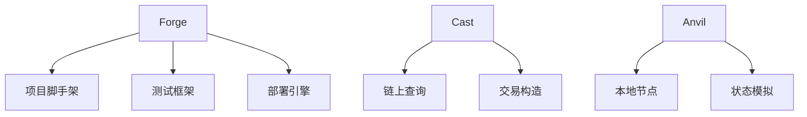

## 1. 工具链全景概览

Foundry是以太坊智能合约开发领域的革命性工具集，其核心组件通过高效协同构建了完整的开发工作流。工具链包含四大核心组件:

| 工具名称       | 功能定位              | 核心优势               |
| -------------- | --------------------- | ---------------------- |
| ​**​Forge​**​  | 智能合约开发脚手架    | 极速编译与测试框架     |
| ​**​Cast​**​   | 区块链交互瑞士军刀    | 多链兼容与灵活查询能力 |
| ​**​Anvil​**​  | 本地以太坊节点模拟器  | 秒级状态重置与调试支持 |
| ​**​Chisel​**​ | Solidity 实时交互环境 | 即时验证与原型测试能力 |

> ​**​开发效率革命​**​：Foundry 采用 Rust 语言实现，编译速度比传统框架快 3-5 倍

## 2. Forge 核心功能解析

### 2.1 项目初始化

```bash
forge init my-project
```

生成目录:

```bash
my-project/
├── src/
│ ├── MyContract.sol
├── test/
│ └── MyTest.t.sol
├── script/
│ └── Deploy.s.sol
├── .gitignore
├── .env
├── lib/
```

- src/：合约源码
- test/：Solidity 测试用例
- script/：部署脚本
- lib/：依赖管理（支持 Git 子模块）

### 2.2 编译与测试

```bash
forge build --sizes  # 显示编译后合约体积
```

### 2.3 测试框架

```solidity
// test/MyTest.t.sol
import {Test} from "forge-std/Test.sol";

contract MyTest is Test {
    function test_Increment() public {
        vm.prank(alice);  // 模拟用户操作
        counter.increment();
        assertEq(counter.get(), 1);
    }
}
```

测试进阶功能​​：

- Gas 快照对比​​：forge test --gas-report
- 多网络分叉测试​​：forge test --fork-url `<RPC>`
- 覆盖率分析​​：forge coverage --report html

### 2.4 部署与验证流程

```bash
# 一键部署到以太坊主网
forge script script/Deploy.s.sol --rpc-url mainnet --broadcast

# 合约验证（需配置 Etherscan API）
forge verify-contract 0x... src/MyContract.sol --chain-id 1
```

## 3. Cast 区块链交互工具

### 3.1 核心查询功能矩阵

Cast 是一个功能强大的区块链交互工具，支持多种区块链网络的交互操作。以下是 Cast 的一些核心功能：
| 命令类型 | 示例指令 | 输出内容 |
| -------- | -------- | -------- |
| 区块查询 | `cast block 15450511 --json` | 完整区块元数据 |
| 交易解析 | `cast tx 0x... --fields value` | 指定字段提取 |
| 合约调用 | `cast call 0x... "balanceOf(address)" alice` | 直接解析返回值 |

### 3.2 高级交互模式

```bash
# 发送带 ETH 的交易
cast send 0x... "deposit()" --value 1ether --private-key $PK

# 批量查询代币余额
cast interface IERC20 > IERC20.sol  # 自动生成接口
cast balance-of --token 0x... holders.txt
```

## 4. Anvil 本地节点模拟器

### 4.1 核心启动参数

```bash
anvil --block-time 2 --gas-limit 30000000
```

- 预配置账户​​：10 个带 10000 ETH 的测试账户
- 区块时间​​：2 秒/区块
- 区块 Gas 限制​​：30000000

## 6. 实战应用

### QA: 如何解决本地开发测试时，账户没有USDC的问题？

在本地先使用`anvil`启动一个本地的evm节点，然后使用`cast rpc`命令行工具来操作这个本地的evm节点。

这里使用Base Sepolia测试网来启动一个本地的evm节点。

```bash
anvil --fork-url https://base-sepolia.gateway.tenderly.co
```

这样本地就启动了一个最新区块的base sepolia测试网的evm节点。

然后使用`cast rpc`命令行工具来操作这个本地的evm节点。

```bash
unluckyUserUsdc=0xcF93D9de9965B960769aa9B28164D571cBbCE39C

usdc=0x036CbD53842c5426634e7929541eC2318f3dCF7e

toUser=0xa669a8b910cdee8d0eed2ffd066456a05e102297

rpc=http://localhost:8545

cast rpc -r $rpc anvil_impersonateAccount $unluckyUserUsdc

cast call -r $rpc $usdc \
  "balanceOf(address)(uint256)" \
  $unluckyUserUsdc

cast send -r $rpc $usdc \
--from $unluckyUserUsdc \
  "transfer(address,uint256)(bool)" \
  $toUser \
  1000000000000 \
  --unlocked

cast call -r $rpc $usdc \
  "balanceOf(address)(uint256)" \
  $toUser
```

:::tip 提示

同理其他ERC20代币也可以使用这个方法来操作。

:::

## 7. 知识图谱


