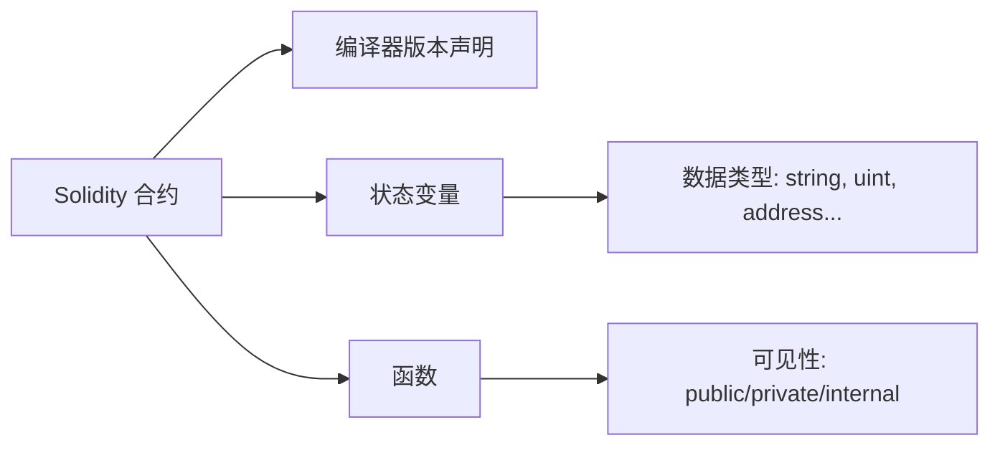

### 1. 什么是 Solidity？

Solidity 是一种**面向智能合约的高级编程语言**，专为以太坊虚拟机（EVM）设计。它支持静态类型、继承、库等特性，是开发去中心化应用（DApp）的核心工具。

---

### 2. 合约结构解析

一个最简单的 Solidity 合约包含以下核心部分：

```solidity
// SPDX-License-Identifier: MIT  // 许可证声明（必填）
pragma solidity ^0.8.20;        // 编译器版本声明

contract HelloWorld {           // 合约定义
    string public greeting = "Hello, World!";  // 状态变量
}
```

### 代码解释：

- **SPDX-License-Identifier**
  声明合约的开源许可证（如 MIT），避免法律风险。
- **pragma solidity**
  指定编译器版本（如 ^0.8.20 表示兼容 0.8.20 及以上版本）。
- **contract 关键字**
  定义一个智能合约，类似于面向对象编程中的“类”。
  ​状态变量 greeting
  存储合约数据的全局变量，public 修饰符会自动生成一个同名 getter 函数

### 3. 使用 Foundry 编译与部署

#### 步骤 1：安装 Foundry

```bash
curl -L https://foundry.paradigm.xyz | bash  # 安装 foundryup
foundryup                                    # 安装最新版 Foundry
```

#### 步骤 2：初始化项目

```bash
forge init hello_world   # 创建项目目录
cd hello_world           # 进入项目
```

项目结构如下：

```bash
hello_world/
├── src/
│ └── HelloWorld.sol  # 合约文件
├── script/
├── test/
├── foundry.toml
├── .gitignore
├── .git/
└── README.md
```

#### 步骤 3：编写合约

将上述 HelloWorld 代码保存至 `src/HelloWorld.sol`

#### 步骤 4：编译合约

```bash
forge build  # 编译合约，生成 ABI 和字节码
```

#### 步骤 5：部署到本地测试链

```bash
forge create --rpc-url http://localhost:8545 \
  --private-key <你的私钥> src/HelloWorld.sol:HelloWorld
```

### 4. 核心概念总结（附示意图）



#### 关键点：

- **​数据类型**：包括布尔值（bool）、整数（uint/int）、地址（address）、字符串（string）等。
- **​可见性修饰符**：
  - public: 允许外部和内部调用
  - private: 仅限合约内部访问

### 5. 扩展练习

尝试修改 greeting 变量并重新部署，观察链上数据的变化。例如：

```solidity
string public greeting = "Welcome to Web3!";
```
