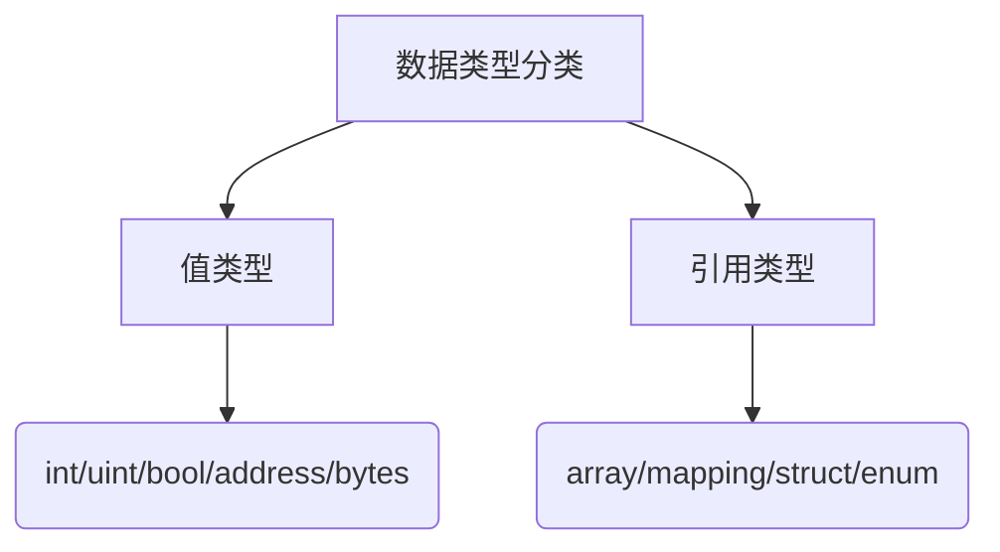

## 1.数据类型分类

Solidity中的数据类型分为**值类型**​（直接存储值）和**引用类型**​（存储数据地址）：  
- **值类型**:  
  - **整型**:
    - `uint`/`int`：无符号/有符号整数 (默认 `uint256`/`int256`，支持 `uint8`-`uint256`、`int8`-`int256`)
    - 溢出保护: Solidity 0.8+ 默认开启溢出检查，需使用 `unchecked` 块关闭
  - **布尔型**: `bool` 
  - **地址**: `address`(20 字节以太坊地址，支持 `.balance` 和 `.transfer()` 方法)
  - **字节数组**: `bytes1`-`bytes32`(固定长度)  
- **引用类型**:  
  - **动态数组**: `uint[]`、`string`  
  - **结构体**: `struct`(自定义复合类型)  
  - **映射**: `mapping(keyType => valueType)`(哈希表存储)
  - **枚举**: `enum`(有限常量集合)




## 2.变量声明与作用域

- **状态变量**：永久存储于区块链，可设置可见性(`public`/`private`/`internal`)

  ```solidity
  uint public count = 0; // 公共状态变量（自动生成 getter 函数）
  address private owner; // 私有变量
  ```

- **局部变量**：函数内声明，临时存储在内存,执行后销毁

  ```solidity
  function increment() internal {
    uint localVar = 0; // 局部变量
  }
  ```
- **常量与不可变量**: 
  - **常量**: `constant` 或 `immutable` 声明，编译时计算，运行时不可变
  - **不可变量**: `constant` 声明，编译时计算，运行时不可变
  
  ```solidity
  uint constant MAX_VALUE = 100; // 常量
  uint immutable MIN_VALUE = 0; // 不可变量
  ```

## 3.数据类型转换

- **隐式转换**: 隐式转换是指Solidity自动进行的类型转换,无需开发者明确指定。
- **显式转换**: 显式转换需要开发者明确指定转换的目标类型,使用语法类似于类型构造函数。

### **隐式转换规则**
- 数值类型转换:
   - 大范围类型可以隐式转换为小范围类型,但可能会导致数据截断。例如,uint256可以隐式转换为uint128,但如果值超出uint128的范围,会被截断。
   - 小范围类型不能隐式转换为大范围类型,需要显式转换。
- 整数类型转换:
   - 无符号整数(uint)和有符号整数(int)之间不能进行隐式转换,必须使用显式转换。
- 地址类型:
   - address类型不能隐式转换为uint或其他类型,需显式转换。
- 枚举类型:
   - 枚举类型不能隐式转换为整数类型,需显式转换。

### **显式转换规则**
- 无符号整数之间的转换：

   ```solidity
   uint8 a = 100;
   uint16 b = uint16(a); // 显式转换
   ```
- 有符号整数之间的转换：

   ```solidity
   int16 a = -100;
   int32 b = int32(a); // 显式转换
   ```

- 无符号整数与有符号整数之间的转换：

   ```solidity
   int8 a = -10;
   uint8 b = uint8(a); // 显式转换, 可能导致不期望的结果
   ```

:::danger 注意

从有符号整数转换为无符号整数时，如果原数值为负数，转换结果将是一个非常大的无符号整数。因此，应谨慎进行此类转换。

:::


- 地址类型与整数类型之间的转换：

   ```solidity title='地址转无符号整数'
   address a = 0x1234567890123456789012345678901234567890;
   uint256 b = uint256(a); // 显式转换
   ```
   ```solidity title='无符号整数转地址'
   uint256 a = 0x1234567890123456789012345678901234567890;
   address b = address(a); // 显式转换
   ```
- 枚举类型与整数类型之间的转换：

   ```solidity title='枚举转无符号整数'
   enum Color { Red, Green, Blue } 
   uint8 a = uint8(Color.Red); // 显式转换
   ```
   ```solidity title='无符号整数转枚举'
   uint8 a = 0;
   Color b = Color(a); // 显式转换
   ```
- 布尔类型与整数类型之间的转换：
   ```solidity title='布尔转无符号整数'
   bool a = true;
   uint8 b = uint8(a); // 显式转换
   ```
- 字节数组与整数类型之间的转换：
   ```solidity
   bytes32 a = keccak256("Hello, World!");
   uint256 b = uint256(a); // 显式转换
   ```

## 4.引用类型

引用类型在赋值或者传递时，是引用数据的存储位置，而不是数据本身。

### 引用类型的存储位置

- 存储(Storage): 永久存储在区块链上的持久化存储,所有状态变量默认存储在此。
- 内存(Memory): 短暂的内存存储,仅在函数执行期间存在。
- Calldata: 特殊的只读存储位置,用于函数参数,尤其是用于外部调用。


#### 存储(Storage)

存储位置用于持久化存储智能合约的状态变量。存储操作消耗较高的Gas,但数据在整个合约生命周期内保持不变。

```solidity
contract StorageExample {
    uint256[] public numbers; // 存储在Storage中

    function addNumber(uint256 num) public {
        numbers.push(num);
    }
}
```

#### 内存(Memory)

内存位置用于临时存储数据,只在函数执行期间存在,Gas消耗较低。内存中的数据不会保留在合约状态中。

```solidity
contract MemoryExample {
    struct Person {
        string name;
        uint256 age;
    }

    function createPerson(string memory name, uint256 age) public pure returns (Person memory) {
        return Person({name: name, age: age});
    }
}
```


#### Calldata

Calldata是专门用于接收外部函数调用参数的只读存储位置,特点是不可修改,Gas消耗较低,适合处理大批量的数据传递。

```solidity
contract CalldataExample {
    function processData(uint256[] calldata data) external pure returns (uint256) {
        uint256 sum = 0;
        for(uint256 i = 0; i < data.length; i++) {
            sum += data[i];
        }
        return sum;
    }
}
```
