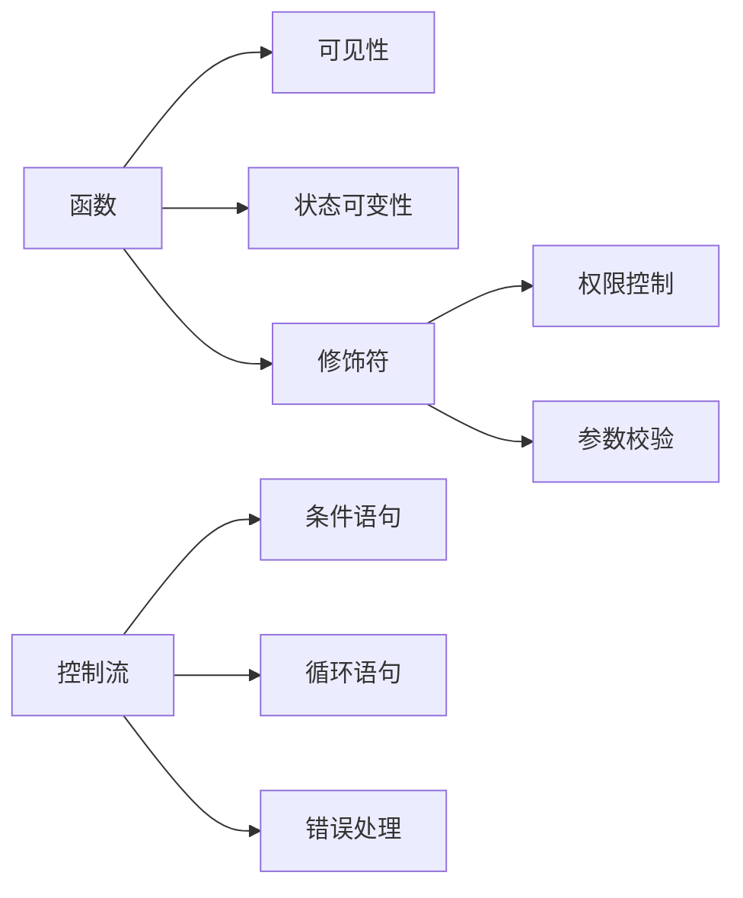

## 1.函数定义与核心特性

### 1.1 函数基本结构

Solidity 函数由 `function` 关键字定义，包含参数列表、可见性修饰符、状态可变性修饰符及返回类型声明

```solidity
function add(uint a, uint b) public pure returns (uint) {  
    return a + b;  
}  
```

- 参数传递​​：支持值传递与引用传递，引用类型需明确数据位置（memory/storage）
- ​​返回值​​：可返回多个值，支持命名式返回或直接返回元组


### 1.2 可见性修饰符

- `public`：合约内外均可访问（自动生成 Getter）
- `private`：仅合约内部访问
- `internal`：仅合约内部及继承合约访问
- `external`：仅合约外部访问（合约内需用 this 调用）


### 1.3 状态可变性修饰符

- `view`：可读取状态变量，不可修改
- `pure`：禁止读写状态变量
- `payable`：允许接收 ETH（默认拒绝）

>> Gas 优化​​：pure/view 函数调用不消耗 Gas（外部直接调用时）


## 2.控制流语句

### 2.1 条件语句

- `if-else` 结构​​:

```solidity
function check(uint x) public pure returns (string memory) {  
    if (x > 100) return "Large";  
    else if (x > 50) return "Medium";  
    else return "Small";  
}
```
- 三目运算符​​:

```solidity
string memory result = x > 100 ? "Large" : "Small";
```

### 2.2 循环语句

| 循环类型 | 描述 | 适用场景 |
| --- | --- | --- |
| `for` 循环 | 明确迭代次数，需初始化、条件、迭代器 | 遍历数组/映射 |
| `while` 循环 | 条件前置，可能零次执行 | 动态终止条件操作 |
| `do-while` | 至少执行一次，条件后置 | 需先执行后验证的场景 |

>> Gas 警告​​：避免无限循环（消耗所有 Gas 导致交易失败）

示例：数组求和

```solidity
// for 循环示例  
function sumArray(uint[] memory arr) public pure returns (uint) {  
    uint total = 0;  
    for (uint i = 0; i < arr.length; i++) {  
        total += arr[i];  
    }  
    return total;  
}  

// while 循环示例  
function sumWhile(uint n) public pure returns (uint) {  
    uint total = 0;  
    uint i = 1;  
    while (i <= n) {  
        total += i;  
        i++;  
    }  
    return total;  
}
```


### 2.3 跳转语句

- `break`​​：立即终止循环（如遍历时找到目标值）
- `continue`​​：跳过当前迭代，进入下一次循环


## 3.高级函数特性

### 3.1 函数修饰符（Modifier）

用于代码复用与权限控制，可组合使用

```solidity
modifier onlyOwner() {  
    require(msg.sender == owner, "Not owner");  
    _; // 执行原函数逻辑  
}  

function changeOwner(address _newOwner) public onlyOwner {  
    owner = _newOwner;  
}
```

常用场景：

- 权限校验（如 onlyOwner）
- 输入参数校验（如 validAddress）
- 防重入攻击（如 nonReentrant）

### 3.2 特殊函数

- 构造函数​​: `constructor` 在合约部署时执行一次，用于初始化状态变量。
- Fallback 函数​​: `fallback()` 未匹配函数调用时触发，可标记为 payable 接收 ETH

```solidity
fallback() external payable {}
```


## 4.错误处理机制

| 方法 | 使用场景 | Gas 处理 |
| --- | --- | --- |
| `require` | 验证输入条件（如参数合法性） | 条件失败时退还剩余 Gas |
| `assert` | 检查内部逻辑错误（如溢出） | 消耗全部 Gas |
| `revert` | 主动回滚交易并返回错误信息 | 可自定义错误消息 |

```solidity
function transfer(address to, uint amount) public {  
    require(amount <= balance[msg.sender], "Insufficient balance");  
    balance[msg.sender] -= amount;  
    balance[to] += amount;  
}
```

## 5.知识图谱


